# Azure Logic Apps – Enterprise Best Practices

> **Enterprise integration guidelines for designing secure, reliable, maintainable, reusable and observable Azure Logic Apps.**

---

## 📌 Overview

Azure Logic Apps is a cloud-based integration and workflow platform that enables orchestration across Azure services, APIs, SaaS applications, databases and enterprise systems.

For enterprise integration, Logic Apps should be designed beyond simple workflow automation. A production-ready Logic App should consider:

* 🔐 Security
* 🛡️ Reliability
* ⚠️ Error handling
* 📊 Observability
* 🔄 Reusability
* 🚀 Performance
* 💰 Cost optimisation
* 📈 Scalability
* 🔧 Maintainability
* 🔗 API governance

This README captures practical design patterns and best practices for enterprise Logic App implementations.

---

# 📑 Table of Contents

* [1. Design Principles](#1-design-principles)
* [2. Error Handling](#2-error-handling)
* [3. Error Propagation](#3-error-propagation)
* [4. Expected vs Unexpected Failures](#4-expected-vs-unexpected-failures)
* [5. Security and API Management](#5-security-and-api-management)
* [6. Documentation and Comments](#6-documentation-and-comments)
* [7. Consumption vs Standard](#7-consumption-vs-standard)
* [8. Choosing the Right Hosting Model](#8-choosing-the-right-hosting-model)
* [9. Looping and Parallelism](#9-looping-and-parallelism)
* [10. Polling and Delay](#10-polling-and-delay)
* [11. Business Failure vs Technical Failure](#11-business-failure-vs-technical-failure)
* [12. Decouple Business Logic](#12-decouple-business-logic)
* [13. HTTP Trigger Security](#13-http-trigger-security)
* [14. HTTP Method Selection](#14-http-method-selection)
* [15. Retry and Resilience](#15-retry-and-resilience)
* [16. Logging and Observability](#16-logging-and-observability)
* [17. Enterprise Integration Architecture](#17-enterprise-integration-architecture)
* [18. Logic App Use Cases](#18-logic-app-use-cases)
* [19. Things to Avoid](#19-things-to-avoid)
* [20. Design Checklist](#20-design-checklist)
* [21. Recommended Enterprise Pattern](#21-recommended-enterprise-pattern)
* [22. Key Takeaways](#22-key-takeaways)

---

# 1. Design Principles

A production-grade Logic App should follow these principles:

| Area               | Best Practice                                         |
| ------------------ | ----------------------------------------------------- |
| 🔐 Security        | Protect endpoints and minimise public exposure        |
| ⚠️ Error Handling  | Implement structured error handling                   |
| 🛡️ Reliability    | Handle transient and permanent failures appropriately |
| 📊 Observability   | Implement logging, correlation and monitoring         |
| 🔄 Reusability     | Decouple reusable business capabilities               |
| 🚀 Performance     | Control concurrency and avoid excessive polling       |
| 💰 Cost            | Select Consumption or Standard based on workload      |
| 🔧 Maintainability | Keep workflows simple and well documented             |
| 🔗 API Governance  | Use API Management where appropriate                  |
| 🧩 Business Logic  | Separate business outcomes from technical failures    |

---

# 2. Error Handling

Error handling is one of the most important aspects of enterprise Logic App design.

A Logic App should explicitly handle:

* Successful processing
* Expected business outcomes
* Recoverable failures
* Non-recoverable failures
* Unexpected technical failures

## 2.1 Try-Catch-Finally Pattern

Use **Scope** actions to implement a structured Try-Catch-Finally pattern.

### Recommended Pattern

```text
Trigger
   |
   v
+-------------------+
|    TRY SCOPE      |
|                   |
|  Business Logic   |
|  Integration      |
|  Transformations  |
+---------+---------+
          |
       Failure
          |
          v
+-------------------+
|   CATCH SCOPE     |
|                   |
| Capture Error     |
| Log Error         |
| Notify            |
| Set Error Flag    |
+---------+---------+
          |
          v
+-------------------+
|  FINALLY SCOPE    |
|                   |
| Cleanup           |
| Evaluate Flag     |
| Propagate Result  |
+-------------------+
```

### Mermaid Architecture

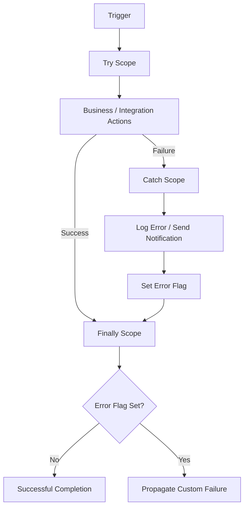

---

## 2.2 Catch Scope Responsibilities

The Catch scope should perform appropriate failure processing.

Recommended activities include:

* Capture workflow run ID
* Capture failed action
* Capture error code
* Capture error message
* Capture correlation ID
* Log diagnostic information
* Send notification where appropriate
* Set an error flag
* Perform compensating actions if required

Example:

```text
Catch Scope
    |
    +-- Get Error Details
    |
    +-- Get Workflow Run ID
    |
    +-- Get Correlation ID
    |
    +-- Write Error Log
    |
    +-- Send Notification
    |
    +-- Set Error Flag = true
```

---

# 3. Error Propagation

A common Logic App design problem occurs when an action fails but a later action succeeds.

Consider:

```text
Action A
   |
   v
Action B  ---> FAILURE
   |
   v
Action C  ---> SUCCESS
   |
   v
Workflow ---> SUCCESS
```

The workflow can appear successful even though an important operation failed.

This makes failed instances difficult to identify and troubleshoot.

## 3.1 Error Flag Pattern

Use an explicit error flag when the workflow must perform additional processing after an error but still needs to propagate the failure.

```text
Initialise Error Flag = false
             |
             v
        +-----------+
        | TRY SCOPE |
        +-----+-----+
              |
        +-----+-----+
        |           |
     Success      Failure
        |           |
        |           v
        |      +----------+
        |      |  CATCH   |
        |      |  SCOPE   |
        |      +----+-----+
        |           |
        |      Error Flag
        |       = true
        |           |
        +-----+-----+
              |
              v
        +-----------+
        |  FINALLY  |
        |   SCOPE   |
        +-----+-----+
              |
              v
       Check Error Flag
          /        \
        No          Yes
        |            |
        v            v
     Success    Custom Failure
```

### Key Principle

> **Do not rely only on the status of the last executed action to determine business success.**

The workflow should explicitly determine whether the overall **business transaction** succeeded.

---

# 4. Expected vs Unexpected Failures

Not every failure should be treated as a technical failure.

## Expected Business Conditions

Examples:

* No records found
* Duplicate record
* Invalid business state
* Business validation failure
* Record already processed
* No change required

These may be valid business outcomes.

## Unexpected Technical Failures

Examples:

* Authentication failure
* Network failure
* Connector failure
* Configuration error
* Unexpected API response
* Runtime exception
* Backend unavailable

These should normally be logged, monitored and propagated appropriately.

### Recommended Model

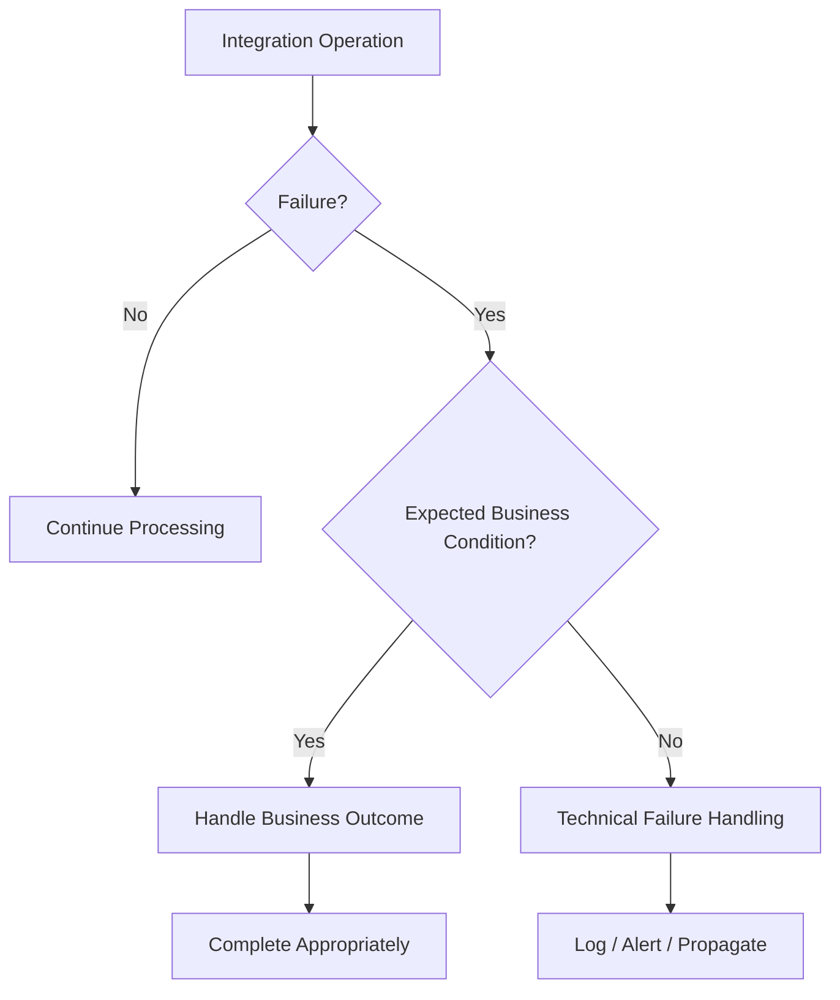

---

# 5. Security and API Management

HTTP-triggered Logic Apps should generally not be directly exposed to external consumers when they form part of an enterprise API landscape.

A recommended enterprise pattern is:

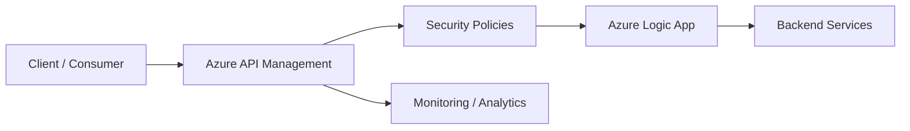

## Benefits of API Management

API Management can provide:

* OAuth 2.0
* OpenID Connect
* Subscription keys
* Rate limiting
* Quotas
* IP filtering
* Request validation
* Header validation
* API transformation
* API versioning
* API policies
* Monitoring and analytics
* Centralised API governance

### Recommended Security Boundary

```text
External Consumer
       |
       v
Azure API Management
       |
       +-- Authentication
       +-- Authorization
       +-- Subscription
       +-- Rate Limiting
       +-- IP Filtering
       +-- Request Validation
       +-- Monitoring
       |
       v
Azure Logic App
       |
       v
Backend Systems
```

Logic App HTTP triggers commonly use HTTPS and SAS-based access. Trigger URLs and SAS information should therefore be treated as sensitive information.

### Security Principle

> **Use API Management as the controlled API boundary where Logic Apps are exposed as enterprise APIs.**

---

# 6. Documentation and Comments

Logic Apps should be understandable to developers, architects and support teams.

Add meaningful descriptions/comments to:

* Triggers
* Actions
* Scopes
* Variables
* Complex expressions
* API calls
* Transformation logic
* Polling logic
* Error-handling logic

## Example

```text
Action:
Get Data Factory Pipeline Status

Description:

Poll the Data Factory pipeline until it reaches a terminal
state. A delay is intentionally introduced between polling
requests to reduce unnecessary API calls and avoid excessive
load on the target service.
```

Good documentation improves:

* Code reviews
* Troubleshooting
* Knowledge transfer
* Maintainability
* Developer onboarding

---

# 7. Consumption vs Standard

Azure Logic Apps provides two major hosting models:

1. **Logic Apps Consumption**
2. **Logic Apps Standard**

The decision should consider:

* Workload size
* Execution frequency
* Number of workflows
* Networking requirements
* Performance
* Scalability
* Cost
* Operational requirements

---

## 7.1 Logic Apps Consumption

Logic Apps Consumption is well suited for smaller and simpler integrations.

### Characteristics

* Consumption-based execution model
* Cost primarily associated with workflow execution/actions and related resources
* Suitable for event-driven workloads
* Suitable for smaller orchestration scenarios
* Individual workflows are managed as separate workflow resources

### Suitable Scenarios

* Small integrations
* Low-volume workloads
* Event-driven processing
* Notification workflows
* Simple API integrations
* Lightweight orchestration

---

## 7.2 Logic Apps Standard

Logic Apps Standard provides a more application-style hosting model.

### Key Capabilities

* Stateful workflows
* Stateless workflows
* Multiple workflows within a single Logic App Standard resource
* Virtual network integration
* Private endpoint support
* Greater control over hosting and networking
* Enterprise integration scenarios

### Example

```text
Logic App Standard
|
+-- Workflow 1
|     +-- Customer Integration
|
+-- Workflow 2
|     +-- Notification
|
+-- Workflow 3
|     +-- Data Synchronisation
|
+-- Workflow 4
|     +-- API Integration
|
+-- Workflow 5
      +-- Error Processing
```

---

# 8. Choosing the Right Hosting Model

### Decision Flow

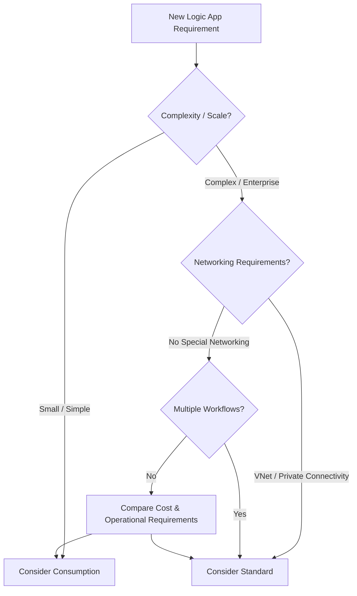

## Comparison

| Capability                      | Consumption |        Standard |
| ------------------------------- | ----------: | --------------: |
| Simple orchestration            |           ✅ |               ✅ |
| Event-driven workload           |           ✅ |               ✅ |
| Execution-based pricing         |           ✅ |               ❌ |
| Multiple workflows per resource |           ❌ |               ✅ |
| Stateful workflows              |           ✅ |               ✅ |
| Stateless workflows             |           ❌ |               ✅ |
| VNet integration                |     Limited |               ✅ |
| Private networking scenarios    |     Limited |               ✅ |
| Enterprise workloads            |    Possible | Often preferred |
| Hosting control                 |       Lower |          Higher |

> Always validate the current Azure feature set and pricing before making a production architecture decision.

---

## Cost Considerations

Do not select a hosting model based only on the number of Logic Apps.

Consider:

* Execution frequency
* Number of actions
* Connector usage
* Data volume
* Throughput
* Number of workflows
* Networking requirements
* Number of environments
* High availability requirements
* Monitoring requirements
* Operational overhead

### General Guidance

**Consumption** can be attractive for smaller and simpler workloads where execution-based pricing aligns with usage.

**Standard** can be a better architectural fit for enterprise workloads requiring multiple workflows, private networking, stateful/stateless processing or greater hosting control.

---

# 9. Looping and Parallelism

Logic Apps provides looping constructs such as:

* `For each`
* `Until`

The correct choice depends on:

* Sequential processing
* Parallel processing
* Ordering
* Backend capacity
* API throttling
* Data consistency

---

# 9.1 Until Loop

Use an Until loop when a workflow needs to repeatedly execute an operation until a condition is satisfied.

Typical example:

```text
Start Data Factory Pipeline
          |
          v
        Delay
          |
          v
  Check Pipeline Status
          |
          v
      Completed?
       /      \
     No        Yes
     |          |
     +----------+
          |
          v
   Continue Processing
```

### Typical Use Cases

* Polling
* Waiting for asynchronous processing
* Checking job status
* Sequential state-based processing
* Retry-style orchestration

---

# 9.2 For Each Loop

Use a For Each loop when processing a collection of independent items.

Example:

```text
Input Records
      |
      v
   For Each
      |
  +---+---+---+
  |   |   |   |
  v   v   v   v
 R1  R2  R3  R4
  |   |   |   |
  v   v   v   v
 API API API API
```

Iterations can execute concurrently depending on the configured concurrency.

---

# 9.3 Degree of Parallelism

Configure concurrency deliberately.

Consider:

* Target API throttling
* Database capacity
* External service limitations
* Transaction ordering
* Data consistency
* Downstream system performance
* Number of records

Example:

```text
1000 Records
      |
      v
   For Each
      |
      +-- Degree of Parallelism = 20
      |
      +-- Multiple records processed concurrently
```

Do not automatically maximise concurrency.

> **Higher concurrency does not always mean better performance.**

---

## Important For Each Consideration

For Each iterations have independent execution behaviour.

Therefore, do not assume that a failure in one iteration will automatically stop all other iterations.

Even when concurrency is reduced, the overall execution semantics should be considered carefully.

If strict sequential control or immediate stopping based on an intermediate condition is required, an **Until loop or alternative orchestration pattern** may be more appropriate.

---

# 10. Polling and Delay

When repeatedly checking the status of an external process, introduce an appropriate delay.

### Recommended Pattern

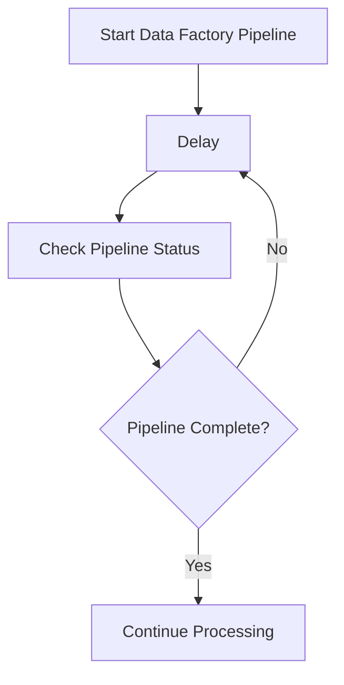

### Avoid

```text
Check Status
     |
     v
Check Status
     |
     v
Check Status
     |
     v
Check Status
     |
     v
...
```

Excessive polling can result in:

* Unnecessary API calls
* Increased throttling risk
* Increased connector executions
* Additional load on target systems
* Increased cost

### Best Practice

Use a polling interval appropriate to:

* Expected processing time
* Target system capacity
* API limits
* Business SLA

---

# 11. Business Failure vs Technical Failure

A business outcome should not automatically be treated as a technical failure.

## Poor Design

```text
Query Database
      |
      v
No Records Found
      |
      v
Workflow = FAILED
      |
      v
Alert Generated
```

If "no records found" is a valid business outcome, this can generate unnecessary failures and alerts.

## Better Design

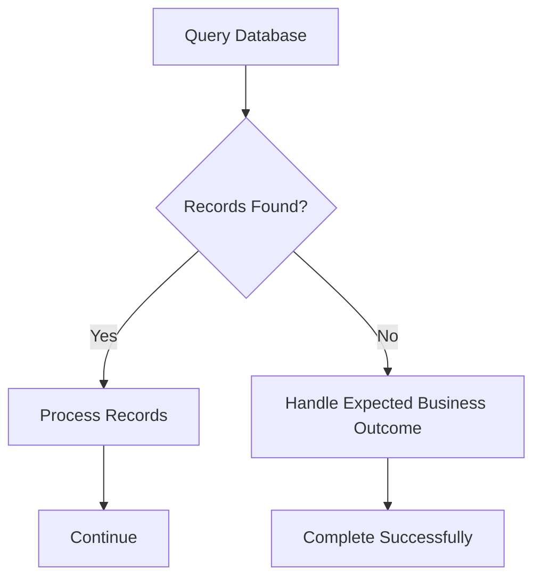

### Principle

> **Technical failure and business outcome are not always the same thing.**

Design workflows so expected business scenarios do not unnecessarily generate failed workflow instances or false operational alerts.

---

# 12. Decouple Business Logic

Avoid creating a single large Logic App containing unrelated business processes.

## Monolithic Design

```text
Large Logic App
|
+-- Customer Processing
+-- Notification
+-- Data Transformation
+-- Error Processing
+-- ServiceNow Integration
+-- Entra ID Integration
+-- Reporting
```

This can become difficult to:

* Maintain
* Test
* Deploy
* Troubleshoot
* Reuse
* Scale

---

## Recommended Design

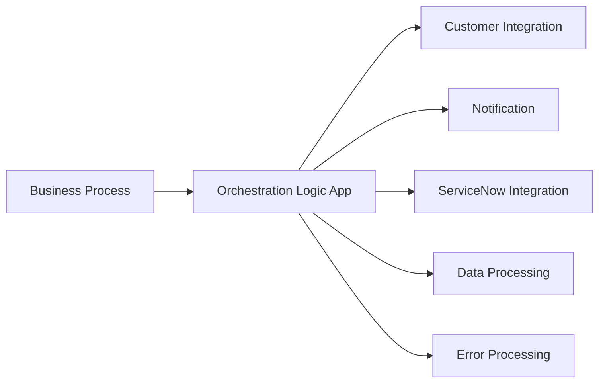

### Benefits

Decoupling provides:

* Reusability
* Easier maintenance
* Independent deployment
* Smaller workflows
* Better troubleshooting
* Separation of responsibilities
* Reduced coupling
* Easier testing

---

# 13. HTTP Trigger Security

Avoid exposing Logic App HTTP trigger URLs directly to external consumers where an API gateway can be used.

## Avoid

```text
External Consumer
       |
       v
Logic App HTTP Trigger
```

## Prefer

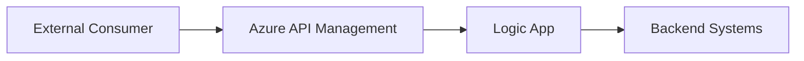

### Why?

Logic App HTTP trigger URLs can contain SAS-based access information.

If such URLs are distributed widely:

* Access control becomes harder to manage
* Consumers become coupled to the Logic App endpoint
* API governance is reduced
* Trigger URL protection becomes important
* Rotation can become operationally difficult

### Recommended Pattern

> **Expose the API through API Management and keep the Logic App as the backend integration implementation.**

---

# 14. HTTP Method Selection

When using:

> **When an HTTP request is received**

define the API contract explicitly.

Do not automatically use POST for every operation.

Typical REST semantics include:

| Operation         | HTTP Method |
| ----------------- | ----------- |
| Retrieve resource | `GET`       |
| Create resource   | `POST`      |
| Replace resource  | `PUT`       |
| Partial update    | `PATCH`     |
| Delete resource   | `DELETE`    |

The actual method should always be based on the API contract and business operation.

---

# 15. Retry and Resilience

External systems can experience temporary failures.

Examples include:

* HTTP 429 – Too Many Requests
* HTTP 408 – Request Timeout
* HTTP 502 – Bad Gateway
* HTTP 503 – Service Unavailable
* HTTP 504 – Gateway Timeout

Where appropriate, configure retry policies.

## Retry Pattern

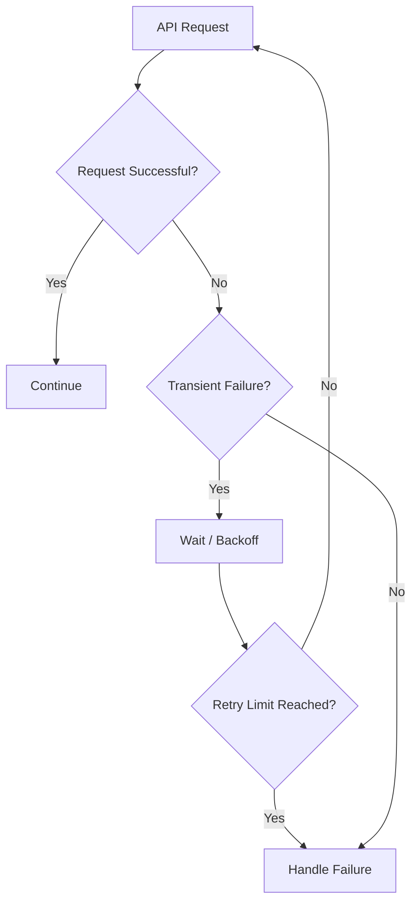

---

## Retry Considerations

Do not blindly retry every error.

Consider:

* Is the failure transient?
* Is the operation idempotent?
* Could retry create duplicate transactions?
* Is the target system rate limited?
* What is the maximum retry count?
* Should exponential backoff be used?
* Should the transaction be moved to an error process?

### Avoid Retrying Permanent Failures

Examples:

* Invalid authentication
* Invalid request
* Business validation failure
* Missing required configuration
* Invalid data

---

# 16. Logging and Observability

Enterprise Logic Apps should be designed for operational visibility.

Capture appropriate information such as:

* Correlation ID
* Workflow Run ID
* Source system
* Target system
* Transaction ID
* Processing status
* Error code
* Error message
* Failed action
* Timestamp
* Retry information

---

## Observability Pattern


---

## Correlation ID

Use a consistent correlation identifier across the integration flow.

Example:

```text
Client Request
     |
     | Correlation-ID: ABC-123
     v
API Management
     |
     | Correlation-ID: ABC-123
     v
Logic App
     |
     | Correlation-ID: ABC-123
     v
Azure Function
     |
     | Correlation-ID: ABC-123
     v
Backend System
```

This makes it easier to trace a transaction across multiple integration components.

---

## Avoid Logging Sensitive Information

Never unnecessarily log:

* Passwords
* Client secrets
* Access tokens
* SAS tokens
* API keys
* Sensitive personal information
* Confidential business data

---

# 17. Enterprise Integration Architecture

A typical enterprise integration architecture can use Logic Apps together with:

* Azure API Management
* Azure Functions
* Azure Data Factory
* Azure Service Bus
* Azure Event Grid
* Azure Event Hubs
* Azure Storage
* Azure SQL
* Microsoft Entra ID
* ServiceNow
* Azure Key Vault
* Azure Monitor
* Application Insights
* Azure DevOps CI/CD

### Example Enterprise Architecture

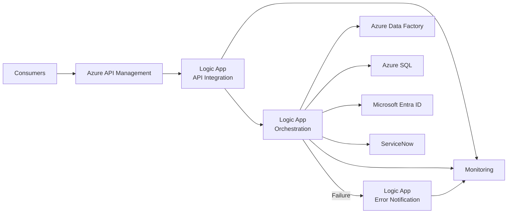

---

# 18. Logic App Use Cases

## 18.1 Error Notifications

Logic Apps can be used to provide centralised error notification workflows.

### Example

```text
Azure Data Explorer
       |
       v
Ingestion Failure
       |
       v
Error Handling Logic App
       |
       v
Consolidated Error Notification
       |
       v
Support / Operations Team
```

### Benefits

* Centralised notifications
* Reduced alert noise
* Consolidated failures
* Easier operational support

---

# 18.2 Asynchronous Processing

Logic Apps are suitable for orchestrating asynchronous business processes.

### Example

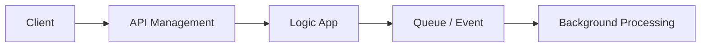

This allows the initiating system to receive an acknowledgement without waiting for the complete backend process.

---

# 18.3 API Integration

Logic Apps can orchestrate integrations between APIs and enterprise systems.

### Example

```text
Consumer
   |
   v
API Management
   |
   v
Logic App
   |
   +---- ServiceNow
   |
   +---- Microsoft Entra ID
   |
   +---- Azure SQL
   |
   +---- Other Enterprise APIs
```

Typical operations include:

* Reading ServiceNow requests
* Creating ServiceNow records
* Updating ServiceNow records
* Retrieving Microsoft Entra ID information
* Synchronising enterprise data
* Orchestrating multiple APIs
* Implementing business workflows

---

# 19. Things to Avoid

## ❌ 1. Direct External Exposure

Avoid:

```text
Internet
   |
   v
Logic App HTTP Trigger
```

Prefer:

```text
Internet
   |
   v
API Management
   |
   v
Logic App
```

---

## ❌ 2. Hardcoded Secrets

Never hardcode:

* Passwords
* Client secrets
* API keys
* SAS tokens
* Connection strings

Use appropriate Azure security services and managed identity where supported.

---

## ❌ 3. Large Monolithic Workflows

Avoid putting unrelated business processes into one very large workflow.

Prefer:

```text
Business Process
       |
       +----> Workflow A
       |
       +----> Workflow B
       |
       +----> Workflow C
```

---

## ❌ 4. Excessive Polling

Avoid:

```text
Check
Check
Check
Check
Check
Check
...
```

Use an appropriate delay.

---

## ❌ 5. Uncontrolled Parallelism

Do not configure maximum concurrency without considering downstream systems.

Avoid:

```text
Logic App
    |
    v
100 Parallel Requests
    |
    v
Backend API
    |
    v
HTTP 429 / Throttling
```

---

## ❌ 6. Treating Business Outcomes as Technical Failures

Example:

```text
No records found
      |
      v
Expected business condition
      |
      v
Do not unnecessarily mark workflow as failed
```

---

## ❌ 7. Relying Only on Final Action Status

Avoid assuming:

```text
Last Action = SUCCESS
        =
Business Process = SUCCESS
```

Track the actual business transaction outcome.

---

# 20. Design Checklist

Use this checklist during Logic App architecture, development and code review.

## Error Handling

* [ ] Try/Catch/Finally pattern implemented where appropriate
* [ ] Failures explicitly detected
* [ ] Error flag used where required
* [ ] Error details captured
* [ ] Correlation ID captured
* [ ] Errors logged
* [ ] Notifications configured where required
* [ ] Expected business conditions handled separately
* [ ] Unexpected technical failures propagated appropriately

## Security

* [ ] HTTP endpoints protected appropriately
* [ ] API Management used as external API boundary where appropriate
* [ ] Authentication implemented
* [ ] Authorization implemented
* [ ] Rate limiting considered
* [ ] IP filtering considered
* [ ] Secrets not hardcoded
* [ ] SAS tokens protected
* [ ] Sensitive data not logged

## Maintainability

* [ ] Triggers documented
* [ ] Important actions documented
* [ ] Complex expressions documented
* [ ] Naming conventions followed
* [ ] Business logic clearly separated
* [ ] Reusable workflows identified
* [ ] Workflows kept manageable

## Performance

* [ ] Correct loop type selected
* [ ] Degree of parallelism reviewed
* [ ] API throttling considered
* [ ] Backend capacity considered
* [ ] Delay added for polling
* [ ] Excessive polling avoided
* [ ] Retry policies reviewed

## Reliability

* [ ] Transient failures handled
* [ ] Retry strategy defined
* [ ] Idempotency considered
* [ ] Duplicate processing considered
* [ ] Timeout handling considered
* [ ] Dependency failures considered
* [ ] Error/dead-letter processing considered where appropriate

## Hosting

* [ ] Consumption vs Standard decision documented
* [ ] Cost evaluated
* [ ] Networking requirements evaluated
* [ ] VNet requirements evaluated
* [ ] Private endpoint requirements evaluated
* [ ] Stateful/stateless requirements evaluated
* [ ] Workload volume evaluated

## Observability

* [ ] Correlation ID implemented
* [ ] Workflow Run ID captured
* [ ] Transaction ID captured
* [ ] Errors logged
* [ ] Processing status logged
* [ ] Monitoring configured
* [ ] Alerts configured
* [ ] Sensitive data excluded from logs

---

# 21. Recommended Enterprise Pattern

The following pattern combines the major recommendations in this document.

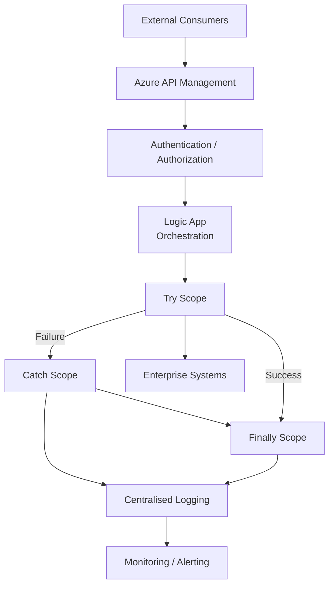

### Enterprise Integration Flow

```text
External Consumer
        |
        v
Azure API Management
        |
        +-- Authentication
        +-- Authorization
        +-- Subscription
        +-- Rate Limiting
        +-- Validation
        +-- Monitoring
        |
        v
Logic App
        |
        +-- Try Scope
        |      |
        |      +-- Business Logic
        |      +-- API Integration
        |      +-- Data Transformation
        |
        +-- Catch Scope
        |      |
        |      +-- Error Logging
        |      +-- Notification
        |      +-- Error Flag
        |
        +-- Finally Scope
               |
               +-- Cleanup
               +-- Status Evaluation
               +-- Failure Propagation
```

---

# 22. Key Takeaways

The most important enterprise Logic Apps principles are:

1. **Implement structured error handling using Try/Catch/Finally scopes.**

2. **Do not rely solely on the final action status to determine business success.**

3. **Use an explicit error flag when failures need to be propagated after additional processing.**

4. **Separate expected business outcomes from technical failures.**

5. **Use API Management as the controlled API boundary for external consumers where appropriate.**

6. **Protect Logic App trigger URLs and never expose secrets or SAS tokens unnecessarily.**

7. **Document triggers, actions and complex business logic.**

8. **Choose Consumption vs Standard based on workload, networking, scale, cost and operational requirements.**

9. **Use `For each` and `Until` based on the actual processing requirement.**

10. **Control the degree of parallelism deliberately.**

11. **Introduce delays when polling external systems.**

12. **Use appropriate retry policies for transient failures.**

13. **Consider idempotency before implementing retries.**

14. **Decouple reusable business capabilities into separate workflows.**

15. **Build observability into the integration from the beginning.**

16. **Use correlation IDs to trace transactions across integration components.**

17. **Avoid unnecessary workflow failures caused by expected business conditions.**

18. **Design Logic Apps as enterprise integration components rather than simple workflow scripts.**

---

# 🏗️ Enterprise Integration Design Philosophy

```text
                         SECURE
                           |
                           |
             RELIABLE -----+----- OBSERVABLE
                           |
                           |
             REUSABLE -----+----- MAINTAINABLE
                           |
                           |
                         SCALABLE
```

> **Design Goal:** Build Azure Logic Apps that are secure, reliable, observable, reusable, maintainable and scalable, with clear business ownership and operational support.

---

# 🔗 Related Azure Integration Technologies

This Logic Apps design guidance can be used together with:

* Azure API Management
* Azure Functions
* Azure Data Factory
* Azure Service Bus
* Azure Event Grid
* Azure Event Hubs
* Azure Storage
* Azure SQL
* Microsoft Entra ID
* Azure Key Vault
* Azure Monitor
* Application Insights
* Azure DevOps CI/CD
* Infrastructure as Code

---

## 📌 Document Information

| Property          | Value                                                               |
| ----------------- | ------------------------------------------------------------------- |
| Technology        | Azure Logic Apps                                                    |
| Category          | Enterprise Integration                                              |
| Document Type     | Architecture & Best Practices                                       |
| Platform          | Microsoft Azure                                                     |
| Focus             | Security, Reliability, Maintainability, Performance & Observability |
| Format            | Markdown                                                            |
| Diagrams          | Mermaid                                                             |
| Intended Audience | Integration Developers, Architects, Technical Leads and Engineers   |

---

## 👨‍💻 Portfolio

This document demonstrates practical knowledge of:

**Azure Integration • Logic Apps • API Management • Enterprise Integration • Error Handling • API Security • Resilience • Observability • Workflow Orchestration • Integration Architecture • Cloud Integration**

---
